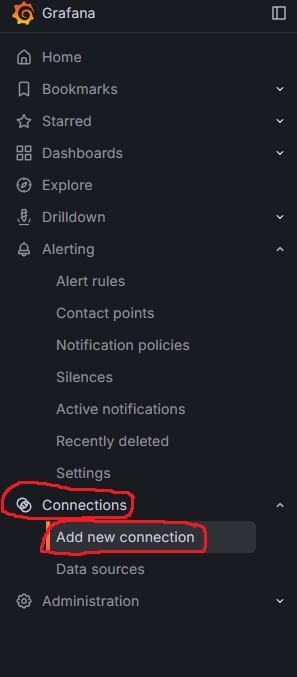
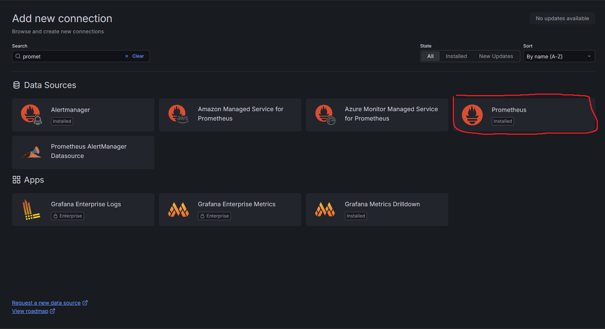
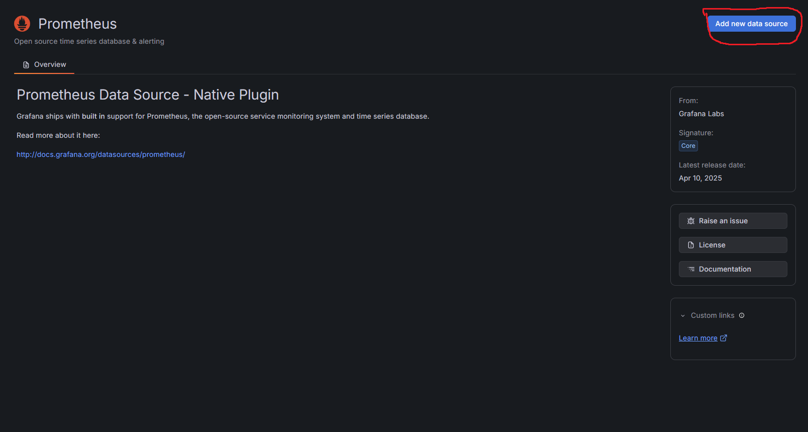
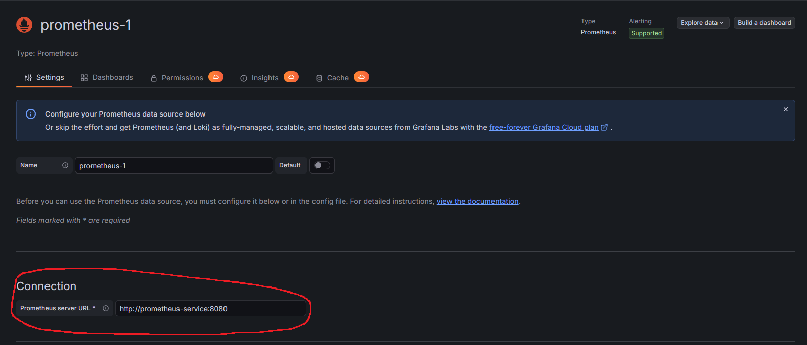
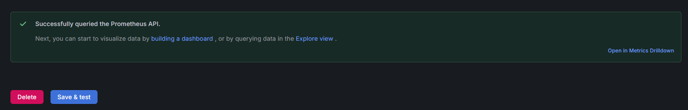

# Kubernetes & Go Monitoring
This application monitoring kubernetes pods which basic Go microservices.

# Features
* Ability to monitor system metrics with Prometheus and visualize them on Grafana

# Technologies
* Monitoring & Visualizing: Prometheus, Grafana
* Containerization & Orchestration: Docker, Kubernetes
* Backend: Go

# Requirements
* Kubernetes Cluster
* Docker

# Usage
1. Clone the Repository
  ```
  git clone git@github.com:xNightwielder/go-k8s-monitoring.git
  cd go-k8s-monitoring
  ```
2. Apply the Kubernetes Deployment
  ```
   kubectl apply -f k8s-deployment.yaml
  ```
> [!NOTE]
> This go application opened outside by Kubernetes Service type's NodePort. If you want to connect to the go application, you must learn which opened outside port this app. Use 'kubectl get services' command for which port opened app. Basic Go app working now which
> after this stage. "localhost:exposedport" for connect app.
3. Apply the Prometheus Deployment. You must follow these steps in order:
  ```
  cd prometheus
  kubectl apply -f prometheus-rbac.yaml
  kubectl apply -f prometheus-config.yaml
  kubectl apply -f prometheus-deployment.yaml
  kubectl apply -f prometheus-service.yaml
  ```
After these steps the prometheus service will start working successfully.
4. Apply the Grafana Deployment. You must follow these steps in order:
  ```
  cd grafana
  kubectl apply -f grafana-deployment.yaml
  kubectl apply -f grafana-service.yaml
  ```
5. Prometheus and Grafana created to be a ClusterIP Service. This reason you must do port-forwarding process for both of them. You must open two terminal and for each one following these steps:
   First Terminal:
   ```
   kubectl port-forward deployment/prometheus-deployment 9090:9090
   ```
   Second Terminal:
   ```
   kubectl port-forward deployment/grafana 3000:3000
   ```
> [!NOTE]
> These terminals musn't close for maintain access.
After these steps Prometheus and Grafana working successfully. These services accessible "localhost:9090" and "localhost:3000" addresses.

6. You must login to Grafana. Your standard username and password are admin. You should to login username: admin, password: admin in Grafana. 

Prometheus Interface:


Grafana Interface:


7. Now you must do Grafana settings for visualizing the Prometheus metrics. You must add Prometheus connection in Grafana. You must following these steps:
   * Open the Grafana Menu on the left side. Come to Connections/Add New Connections
      
   * Select Prometheus Connection
      
   * Click Add New Data Source
      
   * Add connection to Prometheus Server URL. This URL must to be http://prometheus-service:8080
      
   *  Click Save & Test on bottom of page. You must seen "Successfully queried the Prometheus API" message.
      
After these steps you success the grafana-prometheus connection.
8. 
